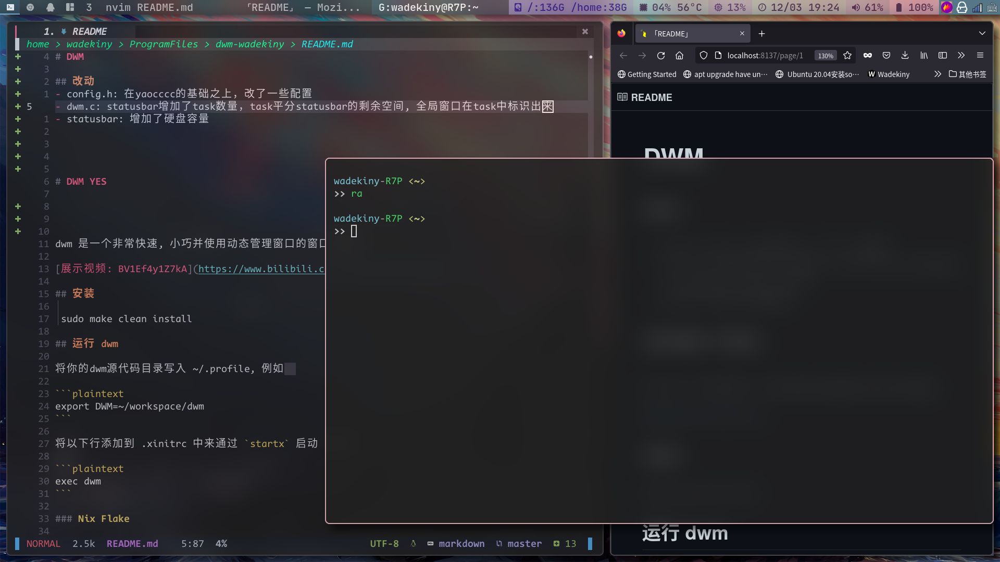

# DWM 

## 改动
- config.h: 在yaocccc的基础之上，改了一些配置
- dwm.c: statusbar增加了task数量，task平分statusbar的剩余空间, 全局窗口在task中标识出来
- statusbar: 增加了硬盘容量




> [展示视频: BV1Ef4y1Z7kA](https://www.bilibili.com/video/BV1Ef4y1Z7kA/)

## config.h

把文件路径改一下，启动一些功能脚本和statusbar
```
static const char *autostartscript = "/home/wadekiny/ProgramFiles/dwm_yaocccc/autostart.sh";
static const char *statusbarscript = "/home/wadekiny/ProgramFiles/dwm-wadekiny/statusbar/statusbar.sh";
```

## 安装
```
sudo make clean install
``` 

## 运行 dwm

安装完后，在登录界面选择dwm，登录
```
pkill Xorg
```

将你的dwm源代码目录写入 ~/.profile, 例如  

```plaintext
export DWM=~/workspace/dwm
```

将以下行添加到 .xinitrc 中来通过 `startx` 启动 dwm:  

```plaintext
exec dwm
```


## 状态栏

请将每一个块置为下列样式, 可直接使用本仓库statusbar相关脚本 或参考使用

```plaintext
  ^c#2D1B46^^b#335566^^sdate^  11/04 00:42 ^d^

  ^c?????^ => 前景色
  ^b?????^ => 背景色
  ^s?????^ => 点击时的信号值
  ^d^      => 重置颜色

  本仓库维护了 statusbar脚本 入口为 ./statusbar/statusbar.sh
  
  模块列表见 ./statusbar/packages
  
  若需要使用 请逐个去查看 修改packages中的脚本文件
  
  请在dwm启动时 调用 $DWM/statusbar/statusbar.sh cron

  注意 ~/.profile中需要有 该环境变量为强依赖关系(我在每个文件中都加了依据DWM=xxx)
  export DWM=~/workspace/dwm

  点击事件发生时 会调用 $DWM/statusbar/statusbar.sh 并传入信号值 请自行处理
  例如 $DWM/statusbar/statusbar.sh date L  # 其中date为信号值 L为按键 (L左键 M中键 R右键)
```


## Q & A

1. 如何启动dwm？

确保 ~/.xinitrc 中有 exec dwm。在tty中使用 startx 命令启动

2. 进入后是黑屏啥都没

壁纸需要用类似feh的软件设置 `feh --randomize --bg-fill ~/pictures/*.png`

3. 打不开终端

务必先修改config.h中启动终端的快捷键，本项目的config.h是我自用的配置 你需要手动修改

例如 可以修改以下部分(如果你用的终端是st的话) 

```plaintext
    /* spawn + SHCMD 执行对应命令 */
    { MODKEY,              XK_Return,       spawn,            SHCMD("st") },
```

4. 字体显示不全

请自行安装字体 仅以archlinux举例

